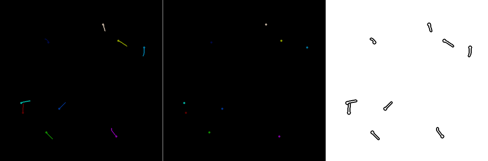

# LarvaAnnotationGUI

## Raw Data Extraction
As the first step, use the script `ExtractGroundTruthFrames.m` to extract a few representative frames from a set of video sequences. Set the input and output folders at the beginning of the script and specify the number of frames that should be extracted from each video. It will then automatically open all contained `*.avi` files and extract the desired number of frames equally distributed over the entire time span.

## Data Labeling
To perform the data labeling, adjust the input path in the script `LarvaAnnotationToolGUI.m` to the path where the input images are located (*e.g.*, the output path you used in the previous step to extract the video frames to). After running the script, a new figure should open up that displays the first image of the specified folder:

You can now start annotating the larvae by left-clicking on the head of a larva and by a second left-click to the tip of the tail. The script automatically tries to center the first click point on the head region and finds the shortest path running along the back of the fish to the second click point. If you want to correct an annotation, simply hit the right button to remove the annotation closest to the mouse cursor. In case the automatic tracing of the fish contour didn't work properly, you can also enforce drawing a straight line using `SHIFT+Left Button` while clicking on the head and tail region, respectively. Use the left and right arrow keys to navigate between the images. Once you're done with the labeling, hit the `S` for save button in order to save the resulting label images as well as the project file. You can also continue the labeling process later, when just reopening the same input folder again.

Result images comprise a larva image (unique label per larva, left), a head image (only comprises the head region using the same label as for the label image, middle) and a don't care image (ones everywhere, except in a region surrounding the larvae, right). Depending on the training scenario, one or the other representation might be more useful.

